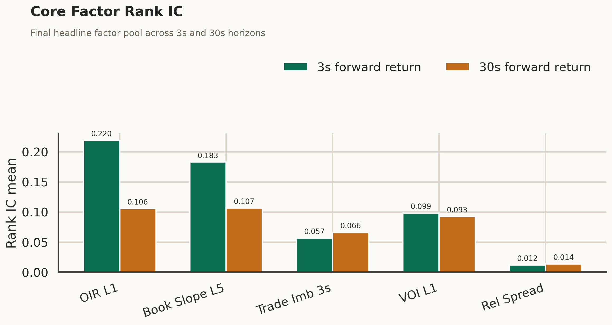
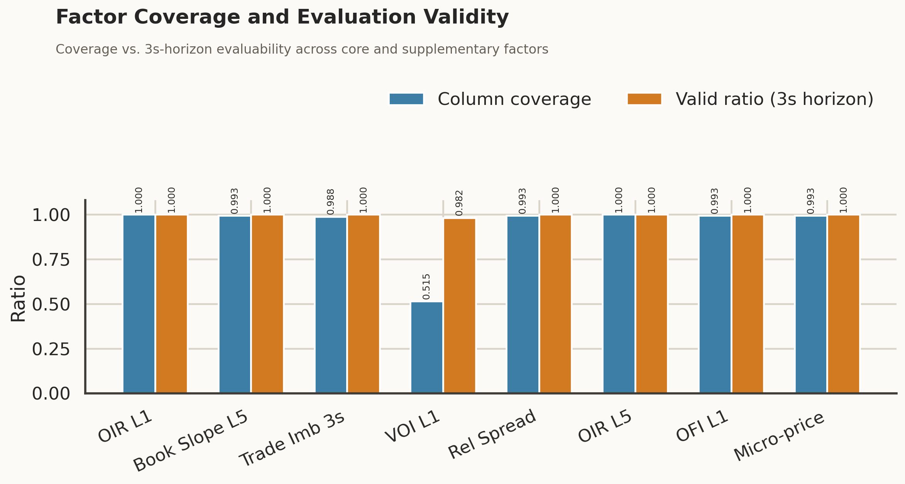
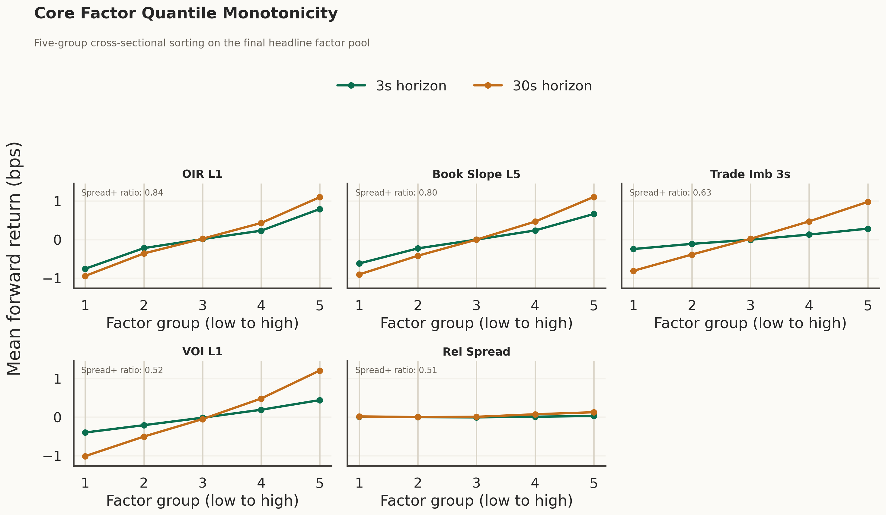
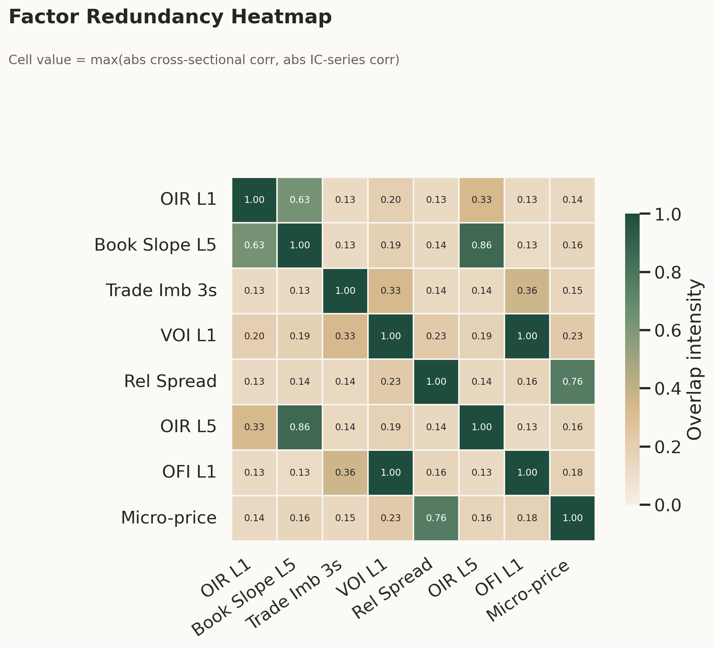

# L2 微观结构 MVP

基于 `Polars Lazy API + Parquet` 构建的低内存 A 股 Level-2 微观结构研究流水线。

这个项目只聚焦一件事：在严格硬件边界下，搭建一套可复现的 Level-2 因子研究管线，并用横截面时间序列 `Rank IC` 做评估，而不是靠自我感动的资金曲线叙事。

英文版说明见：[README.en.md](README.en.md)

## 项目范围

- 市场：A 股深市股票
- 当前研究股票池：40 只高流动性股票
- 样本区间：2025 年 11 月到 12 月
- 数据类型：
  - 3 秒五档快照
  - 逐笔委托
  - 逐笔成交
- 硬件边界：M1 Pro 16GB 统一内存

## 为什么做这个仓库

难点从来不是把几个因子公式抄出来，而是让整条流水线在工程和统计上都站得住：

- 不能把原始 CSV 一股脑堆进内存
- 不能发生跨日污染
- 不能有未来函数
- 不能假装异步时钟天然构成干净横截面

项目代码按职责拆分，每一层只做一件事：

- [`src/l2_project/ingest.py`](/Users/tong/L2_Project/src/l2_project/ingest.py)：扫描原始 CSV、映射 schema、按股票落盘 parquet
- [`src/l2_project/factors.py`](/Users/tong/L2_Project/src/l2_project/factors.py)：构建快照因子表达式与惰性计算图
- [`src/l2_project/trade_factors.py`](/Users/tong/L2_Project/src/l2_project/trade_factors.py)：把逐笔成交聚合到快照时钟，并计算成交流因子
- [`src/l2_project/labels.py`](/Users/tong/L2_Project/src/l2_project/labels.py)：在日内严格对齐未来收益标签，禁止跨日
- [`src/l2_project/panel.py`](/Users/tong/L2_Project/src/l2_project/panel.py)：组装统一横截面面板
- [`src/l2_project/eval.py`](/Users/tong/L2_Project/src/l2_project/eval.py)：计算 Rank IC 时序、整体汇总、月度汇总和阈值扫描
- [`src/l2_project/diagnostics.py`](/Users/tong/L2_Project/src/l2_project/diagnostics.py)：诊断覆盖率、失效原因和个股稀疏性
- [`src/l2_project/robustness.py`](/Users/tong/L2_Project/src/l2_project/robustness.py)：评估上午/下午和月内时段稳定性
- [`src/l2_project/grouping.py`](/Users/tong/L2_Project/src/l2_project/grouping.py)：做横截面分组单调性与 top-minus-bottom 检验
- [`src/l2_project/redundancy.py`](/Users/tong/L2_Project/src/l2_project/redundancy.py)：从横截面相关和 IC 时序相关上诊断因子冗余
- [`src/l2_project/figures.py`](/Users/tong/L2_Project/src/l2_project/figures.py)：生成 README 与项目展示用正式图表

## 因子体系

当前已实现的因子：

- `micro_price_1`
- `relative_spread_1`
- `oir_1`
- `oir_5`
- `book_slope_5`
- `trade_imbalance_3s`
- `voi_1`
- `ofi_1`

几个实现细节需要直接说明：

- `VOI` 与 `OFI` 在代码层已经显式解耦。
- `VOI` 只在最优买卖价都不变时定义。
- `OFI` 保留最佳档位事件流含义。
- `trade_imbalance_3s` 只使用真实成交记录：`price > 0` 且 `side in {0, 1}`，并按 3 秒窗口对齐到快照 `event_time`。
- 非法盘口不会静默传导，而是直接产出空值。

当前展示口径收敛为两层：

- 主展示因子：`oir_1`、`book_slope_5`、`trade_imbalance_3s`、`voi_1`、`relative_spread_1`
- 补充/对照因子：`oir_5`、`ofi_1`、`micro_price_1`

## 标签定义

未来收益标签基于一档中间价计算：

- `fwd_ret_3000ms`
- `fwd_ret_30000ms`

对齐规则：

- 只做 forward match
- 必须同一 `symbol`
- 必须同一 `trading_day`
- 禁止跨日延伸

## 股票池重构

最初的 50 只股票池中存在明显的时钟相位偏移问题。这会直接把很多横截面变成统计幻觉：名义上同一时点，实际却不在同一相位。

当前 40 只深市股票池是通过两层筛选重构出来的：

- 连续竞价时段的 tick-grid 完整性
- 基于逐笔成交与委托条数的流动性代理

这一步是整个项目的真正拐点：项目不再只是和脏时间戳缠斗，而是开始拥有可用的横截面。

## 当前结果快照

最新一次全量重建基于 2025 年 11-12 月、统一 40 只深市股票池。

关键产物：

- 面板：[`data/panel/snapshot_panel.parquet`](/Users/tong/L2_Project/data/panel/snapshot_panel.parquet)
- IC 时序：[`data/eval/rank_ic_timeseries.parquet`](/Users/tong/L2_Project/data/eval/rank_ic_timeseries.parquet)
- 汇总：[`data/eval/rank_ic_summary.parquet`](/Users/tong/L2_Project/data/eval/rank_ic_summary.parquet)
- 月度汇总：[`data/eval/rank_ic_monthly_summary.parquet`](/Users/tong/L2_Project/data/eval/rank_ic_monthly_summary.parquet)
- 阈值扫描：[`data/eval/rank_ic_min_cross_section_scan.parquet`](/Users/tong/L2_Project/data/eval/rank_ic_min_cross_section_scan.parquet)
- 诊断：
  - [`data/diagnostics/column_coverage.parquet`](/Users/tong/L2_Project/data/diagnostics/column_coverage.parquet)
  - [`data/diagnostics/symbol_coverage.parquet`](/Users/tong/L2_Project/data/diagnostics/symbol_coverage.parquet)
  - [`data/diagnostics/pair_reason_summary.parquet`](/Users/tong/L2_Project/data/diagnostics/pair_reason_summary.parquet)
- 稳健性：
  - [`data/robustness/rank_ic_session_summary.parquet`](/Users/tong/L2_Project/data/robustness/rank_ic_session_summary.parquet)
  - [`data/robustness/rank_ic_month_session_summary.parquet`](/Users/tong/L2_Project/data/robustness/rank_ic_month_session_summary.parquet)
  - [`data/robustness/rank_ic_stability_summary.parquet`](/Users/tong/L2_Project/data/robustness/rank_ic_stability_summary.parquet)
- 分组检验：
  - [`data/grouping/group_return_timeseries.parquet`](/Users/tong/L2_Project/data/grouping/group_return_timeseries.parquet)
  - [`data/grouping/group_return_summary.parquet`](/Users/tong/L2_Project/data/grouping/group_return_summary.parquet)
  - [`data/grouping/group_monotonicity_summary.parquet`](/Users/tong/L2_Project/data/grouping/group_monotonicity_summary.parquet)
- 冗余诊断：
  - [`data/redundancy/factor_corr_summary.parquet`](/Users/tong/L2_Project/data/redundancy/factor_corr_summary.parquet)
  - [`data/redundancy/ic_corr_summary.parquet`](/Users/tong/L2_Project/data/redundancy/ic_corr_summary.parquet)
  - [`data/redundancy/factor_redundancy_recommendation.parquet`](/Users/tong/L2_Project/data/redundancy/factor_redundancy_recommendation.parquet)

当前主结论：

- `micro_price_1`、`ofi_1`、`oir_5`、`trade_imbalance_3s` 的 `valid_ratio = 1.0`
- `oir_1` 的 `valid_ratio = 0.999789`
- `book_slope_5` 的 `valid_ratio = 0.999789`
- `relative_spread_1` 的 `valid_ratio = 0.999789`
- `voi_1` 按定义天然更稀疏，但在 `min_cross_section = 10` 下仍达到 `0.981874` 到 `0.985425`
- 非 `VOI` 因子的平均横截面样本数约为 `39.7`，已经接近完整 40 只股票池
- 在当前股票池下，非 `VOI` 因子的 `below_min_cross_section` 问题已经基本消失

当前样本下的因子效果：

- `oir_1` 是最强因子
  - `fwd_ret_3000ms` 上的 `Rank IC mean = 0.219557`
  - `fwd_ret_30000ms` 上的 `Rank IC mean = 0.105844`
- `book_slope_5` 是新增快照因子中最成功的一个
  - `3000ms` 上为 `0.183290`
  - `30000ms` 上为 `0.106717`
- `oir_5` 为正且稳定
  - `3000ms` 上为 `0.106027`
  - `30000ms` 上为 `0.074379`
- `ofi_1` 为正且稳定
  - `3000ms` 上为 `0.054188`
  - `30000ms` 上为 `0.065280`
- `trade_imbalance_3s` 在修正成交方向映射后，表现为正、稠密且稳定
  - `3000ms` 上为 `0.056876`
  - `30000ms` 上为 `0.066407`
  - `valid_ratio = 1.0`
  - `avg_cross_section ≈ 39.26`
- `voi_1` 为正，但按定义结构性更稀疏
  - `3000ms` 上为 `0.098577`
  - `30000ms` 上为 `0.092684`
- `relative_spread_1` 为弱正
  - `3000ms` 上为 `0.012247`
  - `30000ms` 上为 `0.013812`
- `oir_5` 和 `ofi_1` 虽然仍为正，但已经降级为补充层因子
- `micro_price_1` 在当前样本下为负，因此只保留为对照因子，不进入主展示层



这里有一个必须强调的点：股票池重构后最大的改善，并不是简单的 IC 均值上升，而是横截面可计算性被彻底修复。早期混合质量股票池中，大量时间点根本无法满足最小横截面阈值；而在当前 40 只股票池中，大多数因子几乎在每个时间点都可以计算。

这件事已经在 diagnostics 和 robustness 中被显式量化：

- `trade_imbalance_3s` 的 `coverage_ratio = 0.987924`
- `trade_imbalance_3s` 在上午和下午都保持正 IC
- `3000ms` 与 `30000ms` 两个 horizon 下，`positive_segment_ratio = 1.0`
- `VOI` 的稀疏性仍然存在，但现在可以明确归因于因子定义，而不是股票池时钟损坏



分组检验和冗余诊断也已经进入最终选因流程：

- 最终主展示因子不是单纯按 Rank IC 高低挑出来的
- `oir_1`、`book_slope_5`、`trade_imbalance_3s`、`voi_1` 都同时通过了 Rank IC 与分组单调性检验
- `relative_spread_1` 作为一个较弱但不同维度的流动性成本因子，被保留在主展示层
- `book_slope_5` 在冗余诊断后优先于 `oir_5`
- `ofi_1` 因与 `voi_1` 在当前样本上重叠过高，被降级为补充事件流因子
- `micro_price_1` 继续保留为对照项，而不是主因子





## 可复现性

先在项目环境中安装依赖：

```bash
python -m pip install "polars>=1.14.0"
```

全量重建流程：

```bash
python scripts/build_parquet.py
python scripts/run_factors.py --force
python scripts/run_labels.py --force
python scripts/run_panel.py --force
python scripts/run_eval.py --force
python scripts/run_diagnostics.py --force
python scripts/run_robustness.py --force
python scripts/run_grouping.py --force
python scripts/run_redundancy.py --force
python scripts/run_figures.py
```

运行最小测试：

```bash
python -m unittest -v tests.test_smoke
```

## 这个仓库不假装自己是什么

- 它不是回测报告。
- 它不是生产级交易系统。
- 它不声称在当前样本期和股票池之外仍然稳健有效。

但它确实展示了几件更难伪造的能力：

- 在硬件边界下做低内存数据工程
- 显式控制未来函数与跨日污染
- 在不完美的 L2 时钟上构建可信横截面
- 用带诊断透明度的统计检验来评估因子
